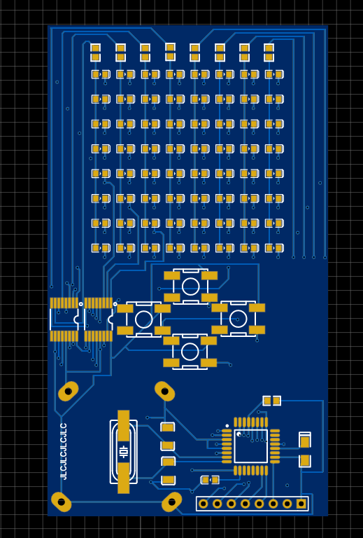
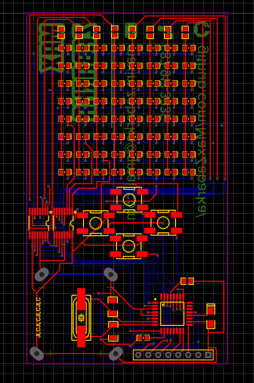
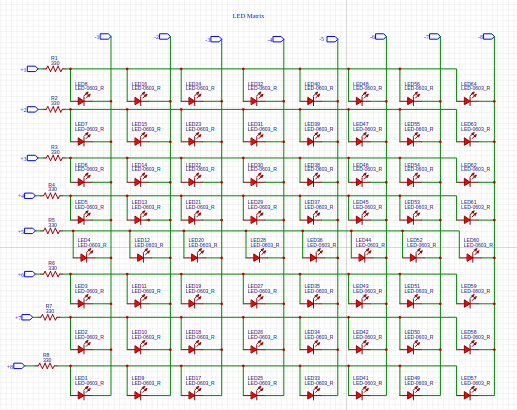
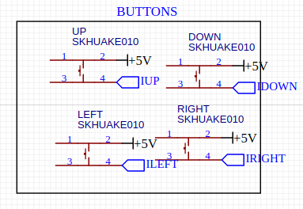
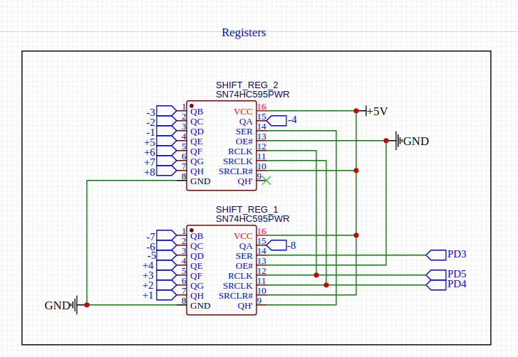
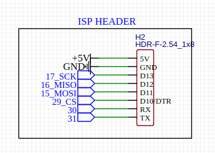

# PCB Business Cards

Business cards made out of printed circuit boards.
Information and coin battery holder on one side, four button keypad and LED matrix on the other.
Programmed to play snake. Games like pong, breakout, connect-four could also be easily implemented.
Uses ATMEGA328P-AU as the microcontroller, the same chip used to drive Arduino boards.

## Visualizations

## Routing

## Schematics

